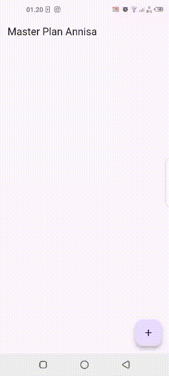

Praktikum 1

Berikut adalah hasil dari praktikum 1, yang berupa aplikasi pencatatan tugas sederhana berbasis model-view, hasilnya anda dapat me-list dan menambahkan tugas ke aplikasi sebanyak-banyaknya, dan dapat di scroll kalau melebihi screen, aplikasi ini utamanya adalah untuk mendambahkan tugas atau catatan singkat yang dapat di list oleh kita.

Praktikum 2

Berikut adalah hasil dari praktikum 2, yang berupa aplikasi pencatatan tugas sederhana berbasis model-view dan menggunakan InheritedNotifier untuk mentracking perubahan pada ValueNotifier<Plan>

Praktikum 3

Berikut adalah hasil dari praktikum 3, aplikasi ini memungkinkan pengguna untuk membuat dan mengelola daftar rencana. Ketika pengguna mengetik dan menambahkan rencana baru, daftar tersebut langsung diperbarui dan ditampilkan di layar. Jika salah satu rencana diklik, aplikasi akan berpindah ke layar lain yang berisi detail rencana tersebut, termasuk daftar tugas yang bisa ditandai sebagai selesai.